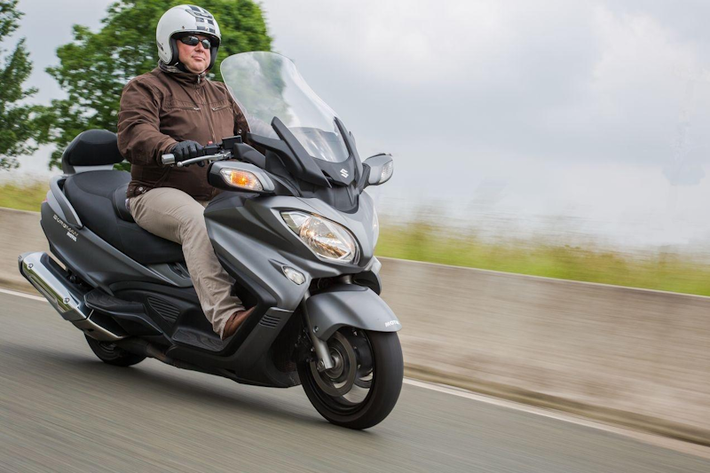
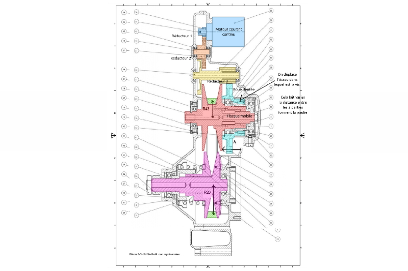
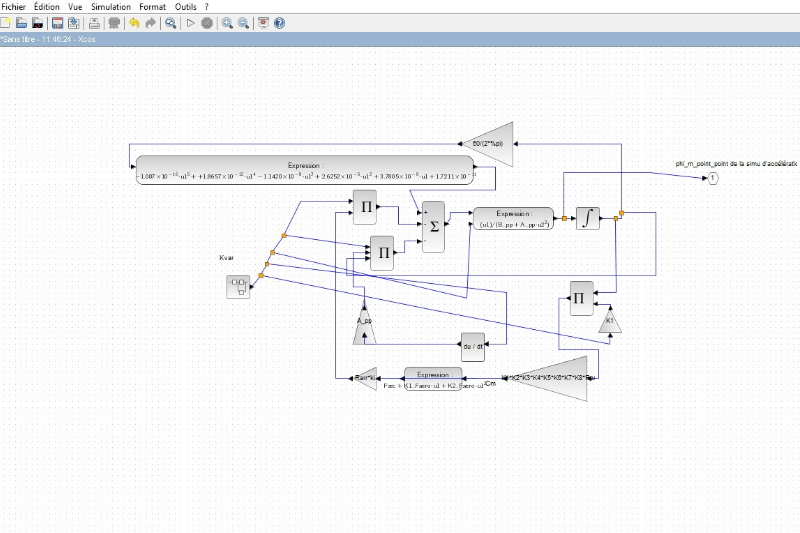
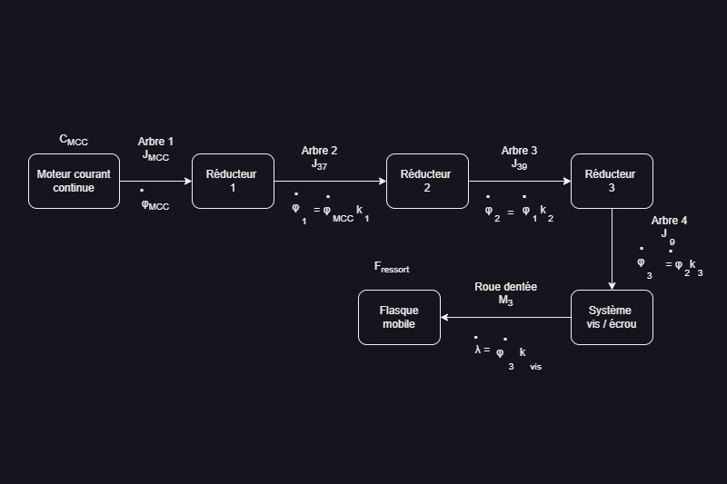

# 🏍️ Burgman650-Simulation

## 🚀 Overview

**Burgman650-Simulation** is an open-source project focused on the **modeling, simulation, and testing** of the **Suzuki Burgman 650 scooter**. This project involves studying the **assembly drawings** of each system component, creating **functional models**, and simulating their interactions using **Xcos on Scilab**. The final step includes analyzing the simulation results to verify alignment with the manufacturer's claimed performance.  

## 🎯 Purpose
- 📜 **System study**: Analyzing the overall assembly and subsystems of the scooter.
- 🔄 **Simulation of interactions**: Ensuring seamless operation between different subsystems.
- 🏁 **Performance validation**: Comparing simulation results with Suzuki’s specifications.

## 📝 Features
| 🏷️ Feature        | 🔍 Description |
|----------------|-------------|
| 📑 **System Analysis** | Studying detailed assembly drawings of each element |
| 🔄 **Simulation** | System interactions tested using **Xcos on Scilab** |
| 📊 **Performance Analysis** | Validates against manufacturer specifications |
| 🔍 **Subsystems Simulated** | Engine, transmission, suspension, braking system, and electronics |
| 🏍️ **Realistic Testing** | Functional simulation approach for real-world performance estimation |
| 🌍 **Open-source** | Modify, adapt, and contribute to the project |

## 📐 System Study & Simulation Preview
| 📜 Assembly Drawing | 🖥️ System Model | 🏗️ Simulation |
|-----------|-----------|-----------|
|  |  |  |

## 🌟 License
This project is open-source. Feel free to use, modify, and contribute! 🚀

